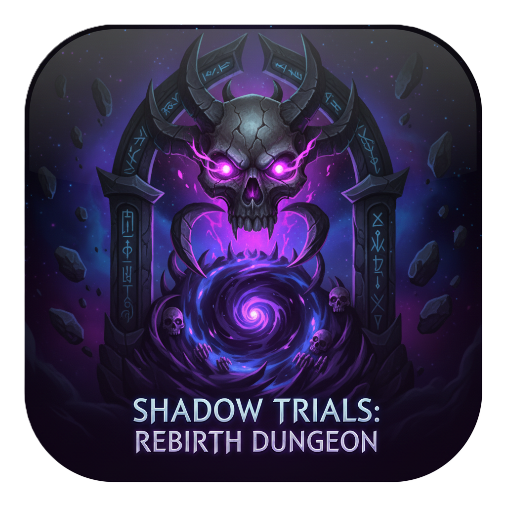

# 暗影试炼：轮回地牢（Shadow Trials: Rebirth Dungeon）



[](LICENSE)


俯视角暗黑风肉鸽 ARPG 学习与实践项目，目标是做成一款可以真正上线 Steam 的小体量精品：在随机生成的地牢中战斗、掉落与成长，每一次死亡都让你变得更强。

---

## 项目定位与目标

- **中文游戏名**：暗影试炼：轮回地牢  
- **英文游戏名**：Shadow Trials: Rebirth Dungeon  
- **玩法标签**：顶视角 / ARPG / Roguelite / 暗黑风 / 单机  
- **项目性质**：开源学习工程 + 最终可发行的完整游戏  
- **开源协议**：MIT License（见下文「许可证」章节）

本仓库不仅是个人/团队练习 Godot 4.5、ARPG 与肉鸽设计的系统案例，也会尽量按照正式商业项目的标准来设计架构、文档与内容生产流程，方便未来导出到 Steam 及其他平台。

---

## 开源说明

- 本项目以 MIT 协议开源，任何人都可以在遵守协议的前提下学习、修改、分发和用于商业项目。  
- 欢迎通过 Issue / PR 反馈问题、提出新想法或贡献代码与文档，具体约定参考根目录 `AGENTS.md`。  
- 适用场景包括：个人技术练习、课程与直播示例、项目脚手架（二次创作时请保留许可证声明）。

---

## 俯视 ARPG 肉鸽项目学习与实践手册（Godot 4.5）

本仓库用于系统学习与实现一个俯视视角的暗黑类（ARPG 风格）肉鸽游戏。目标是以模块化、数据驱动的方式搭建核心循环（移动 - 战斗 - 掉落 - 成长 - 关卡推进），并兼顾易扩展与可维护性。

本文既是整体设计文档，也是后续开发的执行手册。

**目录**
- 项目结构（目标与演进）
- 开发环境与运行
- 输入映射约定
- 架构与模块划分
- 移动与相机（俯视 ARPG）
- 物品与词缀（数据驱动）
- 战斗与碰撞（层与掩码）
- 程序化关卡（房间模板）
- UI/HUD 规范
- 存档与配置
- 代码风格与命名
- 性能与调试
- 导出与版本
- 学习路线与里程碑

---

## 项目结构（目标与演进）

目标结构（当前工程会逐步演进至此）：

```text
/project_root
|
|-- addons/                  # Godot 插件目录。存放从外部获取的插件。
|
|-- assets/                  # 原始、非代码资源目录（美术、音频的源文件，如 .blend, .psd, .wav）。
|   |-- environments/        # 3D 环境模型、材质、纹理的源文件。
|   |-- vfx/                 # 视觉特效的源文件（序列帧、噪声图等）。
|   `-- audio/               # 音频源文件，可再细分为 music/ 和 sfx/。
|
|-- core/                    # 核心代码与全局逻辑目录。游戏的启动和基础框架。
|   |-- main.tscn            # 游戏主入口场景，负责加载全局单例和过渡到主菜单。
|   |-- main.gd              # main.tscn 的附加脚本。
|   |-- globals.gd           # 全局单例（Autoload），用于存放全局配置、工具函数等。
|   `-- scene_manager.gd     # 场景切换管理器（Autoload），处理场景加载和过渡。
|
|-- data/                    # 游戏数据资源目录（Godot Resource 定义，如 .tres, .res）。
|   |
|   |-- characters/          # 存放角色数据定义
|   |   |-- player_classes/  # 玩家职业/角色定义
|   |   |-- enemy_types/     # 敌人类型定义
|   |   `-- npcs/            # NPC 定义
|   |
|   |-- items/               # 物品数据（基础定义、词缀、独特物品等）。
|   |   |-- bases/           # 基础物品类型定义（如：剑、头盔）。
|   |   |-- affixes/         # 词缀数据（如：“火焰的”、“迅捷的”）。
|   |   `-- uniques/         # 独特/传奇物品的定义。
|   |
|   `-- skills/              # 技能数据。
|
|-- features/                # 功能模块目录（核心）。各模块高内聚、低耦合。
|   |-- player/              # 玩家角色（控制器、状态机、场景等）。
|   |-- enemies/             # 敌人相关（AI、种类定义、场景等）。
|   |-- combat/              # 战斗系统（伤害计算、状态效果、弹道逻辑等）。
|   |-- inventory/           # 库存系统。
|   |-- procedural_generation/ # 程序化生成逻辑（地图、关卡等）。
|   |
|   |-- ui/                  # UI 模块
|   |   |-- hud/             # 游戏主界面（HUD）。
|   |   |-- main_menu/       # 主菜单界面。
|   |   |-- settings/        # 设置界面。
|   |   `-- components/      # 可复用的 UI 组件（如自定义按钮、血条、弹出窗口）。
|   |
|   `-- shared/              # 跨模块共享的通用组件或场景。
|       |-- components/      # 可复用的节点组件（如：生命值组件、拾取范围）。
|       |
|       |-- resources/       # 存放共享的 Resource 定义脚本
|       |
|       `-- state_machine/   # 通用的状态机实现。
|
|-- localization/            # 本地化/多语言目录。存放翻译文件（如 .csv, .po）。
|
|-- shaders/                 # 着色器代码目录（.gdshader 文件）。
|   |-- post_processing/     # 后处理效果着色器。
|   |-- materials/           # 用于材质的着色器。
|   `-- particles/           # 用于粒子系统的着色器。
|
|-- docs/                    # 文档目录（设计、规范、研究记录等）。
|
|-- tests/                   # 自动化测试目录（如 GUT, WAT 测试脚本）。
|
|-- tools/                   # 外部工具和脚本目录（如：资源导入器、批处理脚本）。
|
|-- .gitignore               # Git 版本控制忽略文件，务必包含 .godot/ 目录。
|
|-- project.godot            # Godot 项目主配置文件。
|
`-- export_presets.cfg       # 导出预设配置文件（创建导出模板后自动生成）。
```

新增模块时优先放在 `features/<domain>/`，避免把领域逻辑堆在 `core/`。

## 开发环境与运行

- Godot 版本：4.5（渲染：Forward+）。
- 打开方式：启动 Godot，选择本仓库根目录；或命令行 `godot4 --path .`。
- 运行游戏：在 Godot 中按 `F5`，默认入口为 `core/main.tscn`（如有调整以项目设置为准）。
- 导出配置：在 Godot 中通过“项目 -> 导出”维护，保存到 `export_presets.cfg`，不建议手动编辑该文件。

## 输入映射约定

在「项目设置 -> 输入映射」中约定以下动作（脚本会回退到 `ui_*`，但推荐显式配置）：

- 移动：`move_left` / `move_right` / `move_forward` / `move_back`
- 冲刺/疾跑：`dash` / `sprint`

参考默认绑定（键盘/手柄）：

- WASD / 方向键 / 左摇杆：移动
- Shift：疾跑
- B / Circle：冲刺

## 架构与模块划分

- **Core（引导与单例）**
  - `globals.gd`：配置常量、RNG、全局事件总线。
  - `scene_manager.gd`：场景加载、过场、淡入淡出与存档切换。
- **Features（领域模块）**
  - `player/`：移动、动画、状态机、输入适配。
  - `enemies/`：感知（Ray/Area）、FSM/行为树、掉落钩子。
  - `combat/`：伤害结算、抗性、命中/暴击、敌我识别、硬直与无敌帧。
  - `inventory/`：背包、装备槽、属性汇总、掉落拾取。
  - `procedural_generation/`：房间模板拼接、钥匙/门、事件房/精英/商店。
  - `ui/`：HUD、面板、工具提示、数值飘字。

原则：UI 只展示数据，不直接驱动核心逻辑；核心逻辑对 UI 无依赖。

## 移动与相机（俯视 ARPG）

- 角色在 XZ 平面自由移动，不强调跳跃（可根据设计启用/禁用）。
- 配置项：推荐使用 `move_relative_to_camera = true`，提供“相机相对”移动体验。
- 相机结构：`SpringArm3D/Camera3D`，俯视角固定或轻微跟随主角。
- 角色朝向：
  - 默认朝向移动方向。
  - 后续可扩展“朝向鼠标”或“右摇杆指向”。

## 物品与词缀（数据驱动）

- 物品数据存放路径：`data/items/{bases,affixes,uniques}/*.tres`。
- 推荐结构：
  - **基础物品（Base）**：部位类型、基础数值（伤害、攻速、范围）、可滚词缀槽位。
  - **词缀（Affix）**：前/后缀、权重、数值区间、档位（T1–T5）。
  - **实例（ItemInstance）**：根据关卡进度和“幸运值”等因子抽取并固化最终数值。
- 技能资源：`data/skills/*.tres`，字段包含冷却、施法时间、消耗、投射体/范围参数、受属性加成标签等。

## 战斗与碰撞（层与掩码）

在「项目设置 -> 物理 -> 3D -> 层名称」中建议配置：

1. Player
2. Enemy
3. PlayerHitbox（玩家伤害盒/投射物）
4. EnemyHitbox
5. Environment
6. Loot
7. Interactable
8. Sensor（感知/触发区）

实现要点：

- 命中框与受击框分离（`Area3D + CollisionShape3D`），通过信号回调进行结算。
- 投射体使用对象池复用；命中或超出范围后回收；可参数化穿透、弹射等行为。
- 受击反馈统一交由 `combat` 中心逻辑处理（硬直、击退、无敌帧、浮动伤害数字等）。

## 程序化关卡（房间模板）

- 模板路径：`features/procedural_generation/room_templates/` 用于保存可拼接房间（约定入口/出口锚点）。
- 生成器职责：
  - 根据进度生成“走廊 - 战斗 - 事件 - 奖励”等房间序列。
  - 控制稀有度、精英怪、商店、秘境等权重。
  - 确保房间连接合法（不自交、不出现死路或无法抵达的出口）。

## UI/HUD 规范

- HUD 内容：血量、资源（怒气/法力）、经验条、技能栏、Buff/状态图标、战斗浮动信息。
- 交互提示：物品拾取提示（对准/自动/按键）、装备对比（提升为绿色、降低为红色）。
- 工具提示：从 `data/` 中的资源动态拼装（例如范围、冷却、伤害标签、词缀效果）。
- UI 组件集中在 `features/ui/components/`，便于复用和统一风格。

## 存档与配置

- 存档技术选型：
  - 轻量数据：`FileAccess` + JSON。
  - 大量结构化数据：`ResourceSaver` 保存为 `*.tres`。
- 存档内容：
  - 当前 Build（装备、技能、天赋）。
  - 关卡进度（层数、种子、难度）。
  - 用户设置（音量、按键、画质、语言等）。
- 推荐通过 `globals.gd` 暴露统一的 `save_game()` / `load_game()` 接口，并管理本局随机种子。

## 代码风格与命名

> 更详细的贡献规范见根目录 `AGENTS.md`。

- GDScript：
  - 4 空格缩进，UTF-8 编码。
  - 尽量使用类型标注，便于补全和静态检查。
  - 避免在 `_process` 中堆积复杂逻辑，优先用状态机与信号拆分。
- 命名约定：
  - 场景：`PascalCase.tscn`
  - 类名：`PascalCase`
  - 脚本文件：`snake_case.gd`
  - 信号：`something_happened`
  - 常量/枚举：`SCREAMING_SNAKE_CASE`
- 资源与数据：
  - `*.tres` 只存数据，不耦合节点树；脚本读取数据并实例化场景或对象。
- 物理：
  - 清晰配置碰撞层/掩码；避免 Player 直接检测 EnemyHitbox 之外的无关层。

## 性能与调试

- 对象池：对投射体、掉落物、临时特效等频繁创建/销毁的节点进行池化。
- 导航：仅在需要的房间构建 NavMesh，离开房间后及时释放。
- 资源体积：控制贴图分辨率（优先 1K–2K），合理使用压缩和独立的法线/粗糙度贴图。
- 调试工具：
  - `VisibleCollisionShapes`、`DebugDraw`、`NavigationServer` 可视化路径。
  - `RenderingDebugger` 查看渲染瓶颈。

## 导出与版本

- 在 Godot 中通过「项目 -> 导出」添加目标平台预设，保存生成 `export_presets.cfg`。
- 建议采用语义化版本号：`major.minor.patch`。
- 可在 `docs/changelog.md` 中维护简要更新日志（版本、日期、主要改动）。

## 贡献指南

- 提交代码前请阅读根目录 `AGENTS.md`，遵循其中的目录结构与代码风格约定。  
- 建议工作流程：
  - Fork 本仓库并创建特性分支（例如 `feat/combat-crit`）。  
  - 在 Godot 4.5 中运行 `core/main.tscn`，确认主流程可用且新功能正常工作。  
  - 提交 Pull Request 时简要说明改动内容、测试方式，以及相关截图或 GIF（如适用）。  
- 欢迎贡献内容包括：玩法与数值实验、战斗与关卡系统、程序化生成、UI/UX、性能优化、文档与本地化等。

## 学习路线与里程碑（俯视 ARPG）

建议按以下阶段推进，每一步都产出可运行的“小竖切”：

1. **基础移动与相机**：实现角色在 XZ 平面的移动 + 俯视相机跟随。
2. **基础战斗**：近战轻/重击，受击反馈（闪白、硬直）与伤害数字。
3. **投射体技能**：火球/箭矢类技能，包含冷却、消耗与命中判定。
4. **掉落与背包**：基础物品 + 简单词缀，HUD 提示与装备对比。
5. **敌人 AI**：巡逻/追击/攻击，加入少量精英与特殊能力（冰缓、冲锋等）。
6. **程序化房间与关卡推进**：使用房间模板生成小地图，穿插战斗、事件与商店。
7. **存档系统**：支持本局进度与基础元进度（解锁物品/技能池）。
8. **打磨阶段**：补充 VFX/SFX、数值曲线、手柄震动与可达性（如色弱模式）。

每个阶段完成后，建议在 `docs/` 中记录设计决策与踩坑经验，方便回顾与复用。

---

## Steam 上架规划

当你完成前文的大部分学习阶段和核心系统搭建后，可以将本项目视为接近可发行的雏形，再逐步推进以下与 Steam 相关的工作：

- **目标平台**：优先支持 Windows PC（Steam），在条件允许时兼容 Steam Deck。  
- **仓库角色**：本仓库作为 Steam 构建的“公开基线工程”，所有关键玩法与系统都会在这里实现和维护，不在仓库中提交具体的 Steam 应用 ID 等敏感配置。  
- **导出与构建**：使用 Godot 4.5 的 Windows 导出预设（`export_presets.cfg`），在接近发售阶段通过脚本/CI（位于 `tools/` 目录）统一打包并产出 Steam 上传所需的可执行与资源文件。  
- **Steam 特性预留**：后续将预留/接入成就、云存档、截图/富状态（Rich Presence）等功能，具体通过 Steamworks SDK（如 GodotSteam 或自定义 GDExtension）集成。  
- **本地化策略**：利用 `localization/` 目录维护多语言文本，至少保证简体中文与英文完整可玩，其他语言视社区贡献和精力扩展。  
- **发布节奏**：推荐在项目中后期建立 `release` 分支，用于与 Steam 正式版本对齐；`main` 分支保持教学与实验性的迭代，必要差异会在 `docs/` 中说明。

在实际推进时，可以按“优先做出一局完整可玩流程 → 打磨核心循环 → 再补内容与美术 → 最后接入 Steam 特性和商业化包装”的顺序，减少返工成本。

---

## 许可证（License）

本项目采用 MIT 协议开源，你可以在满足协议条款的前提下自由地使用、修改和分发本项目的代码与资源。  
完整协议文本见根目录文件：`LICENSE`。
